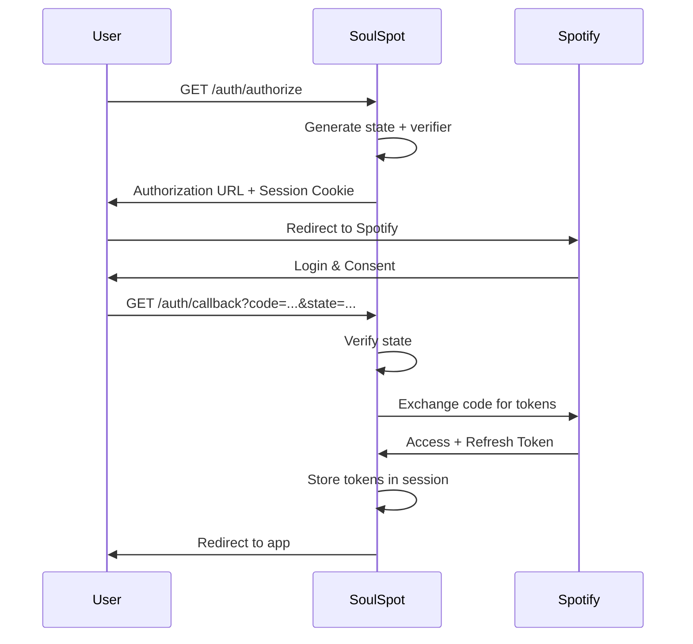
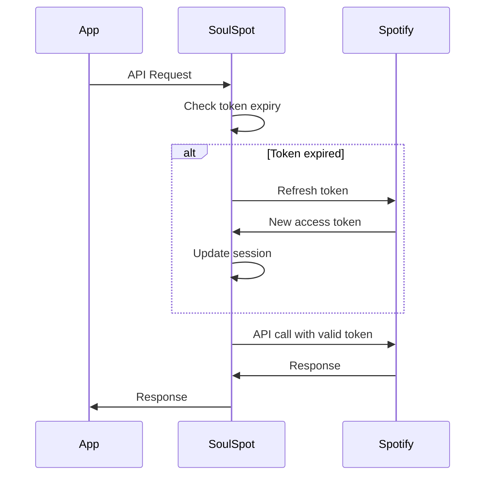

# Authentication

> **⚠️ DEPRECATED:** This feature guide is superseded by **docs/api/auth-api.md** (comprehensive API reference with 9 endpoints, OAuth flow, session management).

<details>
<summary><strong>📁 Archived Content (Click to Expand)</strong></summary>

---

> **Version:** 1.0  
> **Last Updated:** 2025-11-25  
> **Status:** ~~Active~~ SUPERSEDED by auth-api.md

---

## Übersicht

Das Authentication-System verwaltet die Spotify OAuth-Verbindung und Session-Management. Es unterstützt sichere Token-Speicherung, automatische Token-Erneuerung und Multi-Device-Zugriff.

---

## Features

### Spotify OAuth

- **PKCE Flow**: Sicherer OAuth-Flow ohne Client-Secret-Exposition
- **Scope-basiert**: Nur die benötigten Berechtigungen werden angefordert
- **CSRF-Schutz**: State-Parameter verhindert Cross-Site-Request-Forgery

### Session Management

- **Sichere Sessions**: HttpOnly-Cookies mit konfigurierbaren Sicherheitsoptionen
- **Token-Speicherung**: Access und Refresh Tokens sicher in der Datenbank
- **Automatische Erneuerung**: Abgelaufene Tokens werden automatisch erneuert

### Multi-Device Support

- **Server-seitige Token-Speicherung**: Alle Spotify-Tokens werden zentral gespeichert
- **Jedes Gerät authentifiziert sich**: Einfach im Browser einloggen
- **Keine erneute Spotify-Autorisierung**: Einmal verbinden, überall nutzen

---

## OAuth-Scopes

SoulSpot fordert folgende Spotify-Berechtigungen an:

| Scope | Beschreibung |
|-------|--------------|
| `playlist-read-private` | Zugriff auf private Playlists |
| `playlist-read-collaborative` | Zugriff auf kollaborative Playlists |
| `user-library-read` | Zugriff auf gespeicherte Tracks/Alben |
| `user-follow-read` | Zugriff auf gefolgte Artists |

---

## Nutzung über die Web-UI

### Erstmalige Verbindung

1. Öffne die SoulSpot Web-App
2. Klicke auf **Connect Spotify**
3. Du wirst zu Spotify weitergeleitet
4. Melde dich an und bestätige die Berechtigungen
5. Du wirst zurück zur App geleitet

### Session-Status prüfen

1. Klicke auf dein Profil/Avatar
2. Der Status zeigt:
   - **Connected**: Verbindung aktiv
   - **Token Expired**: Token abgelaufen, wird automatisch erneuert
   - **Not Connected**: Keine Verbindung

### Abmelden

1. Klicke auf dein Profil/Avatar
2. Klicke auf **Logout**
3. Deine Session wird gelöscht

---

## API-Endpunkte

### GET `/api/auth/authorize`

Startet den OAuth-Flow.

**Response:**
```json
{
  "authorization_url": "https://accounts.spotify.com/authorize?...",
  "message": "Visit the authorization_url to grant access. Your session is stored securely."
}
```

**Side Effects:**
- Setzt einen Session-Cookie
- Speichert OAuth-State und PKCE-Verifier

### GET `/api/auth/callback`

Verarbeitet den OAuth-Callback von Spotify.

**Query-Parameter:**
| Parameter | Typ | Beschreibung |
|-----------|-----|--------------|
| `code` | string | Authorization Code von Spotify |
| `state` | string | CSRF-Schutz State-Parameter |
| `redirect_to` | string | Ziel-URL nach erfolgreicher Auth (default: "/") |

**Response:** Redirect zur `redirect_to` URL

### POST `/api/auth/refresh`

Erneuert den Access Token.

**Response:**
```json
{
  "message": "Token refreshed successfully",
  "expires_in": 3600,
  "token_type": "Bearer"
}
```

### GET `/api/auth/session`

Gibt Session-Informationen zurück (ohne sensible Daten).

**Response:**
```json
{
  "session_id": "session-uuid",
  "has_access_token": true,
  "has_refresh_token": true,
  "token_expired": false,
  "created_at": "2025-01-15T10:00:00Z",
  "last_accessed_at": "2025-01-15T12:30:00Z"
}
```

### POST `/api/auth/logout`

Beendet die Session und löscht alle Tokens.

**Response:**
```json
{
  "message": "Logged out successfully"
}
```

### GET `/api/auth/spotify/status`

Prüft den Spotify-Verbindungsstatus.

**Response:**
```json
{
  "connected": true,
  "provider": "spotify",
  "expires_at": "2025-01-15T13:00:00Z",
  "token_expired": false
}
```

### POST `/api/auth/onboarding/skip`

Überspringt den Onboarding-Flow.

**Response:**
```json
{
  "ok": true,
  "message": "Onboarding skipped. You can connect Spotify later in settings."
}
```

---

## Sicherheit

### Session-Cookies

| Eigenschaft | Wert | Beschreibung |
|-------------|------|--------------|
| `httponly` | `true` | Nicht via JavaScript zugreifbar |
| `secure` | Konfigurierbar | Nur über HTTPS (Production) |
| `samesite` | `lax` | CSRF-Schutz bei Formularen |

### Token-Speicherung

- Tokens werden verschlüsselt in der Datenbank gespeichert
- Refresh Tokens werden nie im Frontend exponiert
- Abgelaufene Sessions werden automatisch bereinigt

### PKCE (Proof Key for Code Exchange)

SoulSpot verwendet PKCE für zusätzliche Sicherheit:
1. Ein `code_verifier` wird generiert
2. Ein `code_challenge` wird daraus abgeleitet
3. Spotify verifiziert beides bei Token-Exchange

---

## Workflow-Beispiel

### OAuth-Flow



### Token-Refresh



---

## Multi-Device Workflow

### So funktioniert Multi-Device-Zugriff

SoulSpot speichert alle Spotify-Tokens **serverseitig**. Das bedeutet:

1. **Einmalige Autorisierung**: Sie autorisieren SoulSpot einmal bei Spotify
2. **Zentrale Token-Speicherung**: Die Tokens werden in der Datenbank gespeichert
3. **Zugriff von jedem Gerät**: Jedes Gerät im Netzwerk kann sich einloggen

### Szenario: Desktop → Mobile

1. **Desktop**: Verbinde dich mit Spotify über `/auth/authorize`
2. **Mobile**: Öffne SoulSpot im Browser
3. **Mobile**: Authentifiziere dich - der Server hat bereits deine Spotify-Tokens!

### Bearer Token für API-Clients

Für Skripte und Automatisierung kann die Session-ID als Bearer Token verwendet werden:

```bash
# Session-ID aus dem Browser holen (DevTools → Cookies)
curl -H "Authorization: Bearer YOUR_SESSION_ID" \
     http://localhost:8000/api/playlists
```

---

## Troubleshooting

### Problem: "No session found"

**Ursachen:**
1. Cookies sind blockiert
2. Session ist abgelaufen
3. Incognito-Modus

**Lösung:** Starte den OAuth-Flow neu (`GET /auth/authorize`)

### Problem: "State verification failed"

**Ursachen:**
1. CSRF-Angriff (unwahrscheinlich)
2. Session zwischen Authorize und Callback verloren
3. Mehrere Tabs mit OAuth-Flow

**Lösung:** Schließe alle Tabs und starte neu

### Problem: Token-Refresh schlägt fehl

**Ursachen:**
1. Spotify-Berechtigungen widerrufen
2. Spotify-Account-Probleme
3. Netzwerk-Fehler

**Lösung:** Verbinde Spotify neu über `GET /auth/authorize`

### Problem: Multi-Device funktioniert nicht

**Ursachen:**
1. Gerät kann Server nicht erreichen (Firewall)
2. Session abgelaufen

**Lösung:** Prüfe Netzwerkverbindung und authentifiziere dich erneut

---

## Verwandte Features

- [Playlist Management](./playlist-management.md) - Benötigt Spotify-Auth
- [Automation & Watchlists](./automation-watchlists.md) - Benötigt Spotify-Auth
- [Settings](./settings.md) - Für Session-Verwaltung
