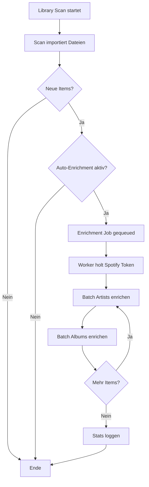
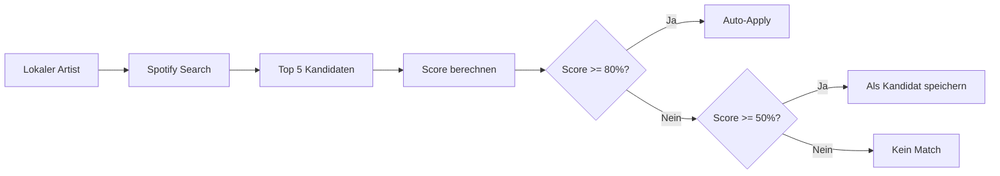

# Local Library Spotify Enrichment

> **Version:** 1.0  
> **Last Updated:** 2025-11-29

---

## Übersicht

Das Local Library Enrichment Feature reichert lokale Musikdateien mit Spotify-Metadaten an. Anders als der Spotify-Sync, der nur gefolgte Artists und Playlists importiert, durchsucht dieses Feature Spotify nach Matches für **alle** lokalen Dateien – unabhängig davon, ob du den Artist auf Spotify folgst.

### Warum ist das nützlich?

1. **Lokale Dateien ohne Spotify-Link**: Du hast MP3s auf der Festplatte, aber sie haben keine Spotify-URIs
2. **Artwork fehlt**: Lokale Dateien haben oft keine Album-Cover
3. **Genres fehlen**: ID3-Tags enthalten selten Genre-Informationen
4. **Konsistente Bibliothek**: Alle Einträge haben dieselben Metadaten-Felder

---

## Features

### Automatisches Enrichment

- **Nach jedem Library Scan**: Wenn aktiviert, startet nach jedem Scan automatisch ein Enrichment-Job
- **Batch-Verarbeitung**: Verarbeitet 50 Items pro Durchlauf (konfigurierbar)
- **Rate Limiting**: 50ms Pause zwischen Spotify-API-Aufrufen
- **Fehlertoleranz**: Einzelne Fehler stoppen nicht den gesamten Prozess

### Matching-Algorithmus

**Für Artists:**
- Fuzzy Name Matching (70% Gewichtung)
- Spotify Popularity (30% Gewichtung)
- Filtert "Various Artists" automatisch aus

**Für Alben:**
- Album-Titel Matching (50% Gewichtung)
- Artist-Name Matching (50% Gewichtung)
- Sucht über Spotify Track Search API

### Confidence Scoring

- **≥80%**: Automatische Anwendung des Matches
- **50-79%**: Kandidat wird für manuelle Überprüfung gespeichert
- **<50%**: Kein Match gefunden

### Dual Album Type System (Lidarr-kompatibel)

Das System verwendet zwei Typ-Dimensionen wie Lidarr/MusicBrainz:

**Primary Type** (exklusiv):
- `album` - Standard-Album
- `ep` - Extended Play
- `single` - Single
- `broadcast` - Radio-Aufnahme
- `other` - Sonstiges

**Secondary Types** (kombinierbar):
- `compilation` - Compilation/Various Artists
- `soundtrack` - Soundtrack
- `live` - Live-Aufnahme
- `remix` - Remix-Album
- `dj-mix` - DJ Mix
- `mixtape` - Mixtape
- `demo` - Demo
- `spokenword` - Hörbuch/Spoken Word

**Beispiel:** Ein Live-Album einer Compilation hat:
- `primary_type = "album"`
- `secondary_types = ["live", "compilation"]`

### Various Artists Detection (Lidarr-Style)

Das System erkennt Compilations automatisch durch mehrere Heuristiken (in Prioritätsreihenfolge):

#### 1. Explicit Compilation Flags (höchste Priorität)
- **TCMP** Tag (ID3 - iTunes Compilation)
- **cpil** Tag (MP4)
- **COMPILATION** Tag (Vorbis/FLAC)

#### 2. Album Artist Pattern Matching
Erkannte Patterns (case-insensitive):
- "Various Artists", "VA", "V.A.", "V/A"
- "Diverse", "Verschiedene", "Verschiedene Künstler" (German)
- "Varios Artistas" (Spanish)
- "Artistes Divers" (French)
- "Artisti Vari" (Italian)
- "Sampler", "Compilation", "Soundtrack", "OST"
- "Unknown Artist", "[Unknown]"

#### 3. Track Artist Diversity Analysis
Lidarr-kompatible Schwellenwerte:
- **≥75% Diversity**: Wenn ≥75% der Tracks unterschiedliche Künstler haben → Compilation
- **<25% Dominant**: Wenn kein Künstler >25% der Tracks hat → Compilation
- **Minimum 3 Tracks**: Diversity-Analyse benötigt mindestens 3 Tracks

#### Detection Timing
- **Scan-Zeit**: Explicit Flags + Album Artist Patterns werden sofort erkannt
- **Post-Scan**: Track Diversity Analyse erfolgt nach dem Scan aller Tracks eines Albums

#### Detection Result Tracking
Jede Erkennung speichert:
```python
CompilationDetectionResult(
    is_compilation=True,
    reason="track_diversity",  # explicit_flag, album_artist_pattern, track_diversity, no_dominant_artist
    confidence=0.85,           # 0.0 - 1.0
    details={                  # Extra Info für Debugging
        "diversity_ratio": 0.9,
        "unique_artists": 9,
        "total_tracks": 10
    }
)
```

#### API: Compilation Analyzer

Manuelle Re-Analyse aller Alben nach dem Scan:

```python
from soulspot.application.services import CompilationAnalyzerService

analyzer = CompilationAnalyzerService(session)

# Einzelnes Album analysieren
result = await analyzer.analyze_album(album_id)

# Alle Alben analysieren (nur nicht bereits erkannte)
results = await analyzer.analyze_all_albums(only_undetected=True)

# Statistiken abrufen
stats = await analyzer.get_compilation_stats()
# -> {"total_albums": 500, "compilation_albums": 45, "compilation_percent": 9.0}
```

#### REST API Endpoints

| Endpoint | Method | Beschreibung |
|----------|--------|--------------|
| `/api/library/compilations/analyze` | POST | Einzelnes Album analysieren |
| `/api/library/compilations/analyze-all` | POST | Alle Alben analysieren |
| `/api/library/compilations/stats` | GET | Compilation-Statistiken |
| `/api/library/compilations/set-status` | POST | Status manuell setzen |
| `/api/library/compilations/verify-musicbrainz` | POST | MusicBrainz-Verifikation |
| `/api/library/compilations/verify-borderline` | POST | Bulk MusicBrainz-Verifikation |
| `/api/library/compilations/{id}/detection-info` | GET | Detection-Details für UI |

#### MusicBrainz-Verifikation (Phase 3)

Für borderline Cases (50-75% Diversity) kann MusicBrainz als autoritative Quelle genutzt werden:

```python
# Mit MusicBrainz-Client initialisieren
from soulspot.infrastructure.integrations.musicbrainz_client import MusicBrainzClient

mb_client = MusicBrainzClient(settings.musicbrainz)
analyzer = CompilationAnalyzerService(session, musicbrainz_client=mb_client)

# Einzelnes Album verifizieren
result = await analyzer.verify_with_musicbrainz(album_id)
# -> {"verified": True, "is_compilation": True, "reason": "mb_compilation_type", "mbid": "..."}

# Alle borderline Alben verifizieren (LANGSAM wegen Rate Limit!)
results = await analyzer.verify_borderline_albums(limit=20)
```

**ACHTUNG:** MusicBrainz hat strenge Rate Limits (1 Anfrage/Sekunde). Bulk-Verifikation kann mehrere Minuten dauern!

#### Manual Override

Benutzer können den Compilation-Status manuell überschreiben:

```python
# Als Compilation markieren
await analyzer.set_compilation_status(album_id, is_compilation=True, reason="manual_override")

# Compilation-Status entfernen
await analyzer.set_compilation_status(album_id, is_compilation=False, reason="user_correction")
```

Die UI zeigt entsprechende Buttons im Album-Detail.

---

## Konfiguration

### Settings UI

Navigiere zu **Settings** → **Library** Tab:

| Setting | Default | Beschreibung |
|---------|---------|--------------|
| Auto-Enrich Local Library | ✓ An | Enrichment nach jedem Library Scan |

### Erweiterte Settings (via API/DB)

| Setting | Default | Beschreibung |
|---------|---------|--------------|
| `library.enrichment_batch_size` | 50 | Items pro Batch |
| `library.enrichment_rate_limit_ms` | 50 | Pause zwischen API-Calls (ms) |
| `library.enrichment_confidence_threshold` | 75 | Min. Confidence für Auto-Match (%) |
| `library.enrichment_search_limit` | 20 | Anzahl Spotify-Suchergebnisse |
| `library.enrichment_name_weight` | 85 | Gewichtung Name vs Popularity (%) |
| `library.use_followed_artists_hint` | true | Followed Artists als Hint nutzen |
| `library.enrichment_download_artwork` | true | Artwork auch lokal speichern |
| `library.enrich_compilations` | true | Compilations auch enrichen |

---

## API-Endpunkte

### GET `/api/settings/library/enrichment`

Gibt aktuelle Enrichment-Settings zurück.

**Response:**
```json
{
  "auto_enrichment_enabled": true
}
```

### PUT `/api/settings/library/enrichment`

Aktualisiert Enrichment-Settings.

**Request:**
```json
{
  "auto_enrichment_enabled": false
}
```

**Response:**
```json
{
  "auto_enrichment_enabled": false
}
```

---

## Datenbank-Schema

### soulspot_albums (erweitert)

```sql
-- Neue Spalten für Album Types
album_artist VARCHAR(255)   -- Album-Level Artist (z.B. "Various Artists")
primary_type VARCHAR(20)    -- 'album', 'ep', 'single', 'broadcast', 'other'
secondary_types JSON        -- Array: ["compilation", "live", ...]
```

### enrichment_candidates (neu)

```sql
CREATE TABLE enrichment_candidates (
    id VARCHAR(36) PRIMARY KEY,
    entity_type VARCHAR(20),        -- 'artist' oder 'album'
    entity_id VARCHAR(36),          -- FK zu soulspot_artists/albums
    spotify_uri VARCHAR(255),       -- Spotify URI des Kandidaten
    spotify_name VARCHAR(255),      -- Name für Anzeige
    spotify_image_url VARCHAR(512), -- Preview Image
    confidence_score FLOAT,         -- 0.0 - 1.0
    is_selected BOOLEAN,            -- User hat diesen gewählt
    is_rejected BOOLEAN,            -- User hat diesen abgelehnt
    extra_info JSON,                -- Zusatzinfos (Genres, Followers, etc.)
    created_at DATETIME,
    updated_at DATETIME
);
```

---

## Workflow

### Automatischer Flow



### Matching-Prozess



---

## Architektur

### Komponenten

| Komponente | Pfad | Funktion |
|------------|------|----------|
| LocalLibraryEnrichmentService | `application/services/local_library_enrichment_service.py` | Hauptlogik |
| LibraryEnrichmentWorker | `application/workers/library_enrichment_worker.py` | Job-Handler |
| AppSettingsService | `application/services/app_settings_service.py` | Settings |
| EnrichmentCandidateModel | `infrastructure/persistence/models.py` | DB Model |

### Dependencies

```
LocalLibraryEnrichmentService
├── ArtistRepository (get_unenriched, count_unenriched)
├── AlbumRepository (get_unenriched, count_unenriched)
├── AppSettingsService (enrichment settings)
├── SpotifyImageService (artwork download)
├── SpotifyClient (search API)
└── rapidfuzz (fuzzy matching)
```

---

## Migration

Die Migration `nn25010ppr58_add_album_types_and_enrichment.py` fügt hinzu:

1. **Album-Spalten**: `album_artist`, `primary_type`, `secondary_types`
2. **Enrichment Candidates Table**: Speichert potenzielle Matches
3. **Data Migration**: Markiert existierende "Various Artists" Alben als Compilations

### Migration ausführen

```bash
alembic upgrade head
```

### Rollback

```bash
alembic downgrade -1
```

---

## Troubleshooting

### Enrichment läuft nicht

**Prüfe:**
1. Ist `auto_enrichment_enabled` aktiviert? (Settings → Library)
2. Hat der letzte Scan neue Items importiert?
3. Ist ein gültiger Spotify-Token vorhanden?

**Logs prüfen:**
```bash
grep -i "enrichment" logs/soulspot.log
```

### Falsche Matches

**Problem:** Ein lokaler Artist wurde mit dem falschen Spotify-Artist verknüpft.

**Lösung:**
1. In DB: Setze `spotify_uri = NULL` für den Artist
2. Der nächste Enrichment-Lauf findet ihn erneut
3. Falls wieder falsch: Prüfe `enrichment_candidates` Tabelle

### Keine Artwork heruntergeladen

**Prüfe:**
1. Ist `spotify.download_images` aktiviert?
2. Ist `library.enrichment_download_artwork` aktiviert?
3. Hat der Spotify-Artist/Album ein Bild?

---

## Best Practices

### Vor dem ersten Enrichment

1. **Bibliothek organisieren**: Saubere Ordnerstruktur hilft beim Matching
2. **ID3-Tags prüfen**: Korrekte Artist/Album-Namen verbessern Matches
3. **Backup erstellen**: Falls etwas schiefgeht

### Nach dem Enrichment

1. **Candidates prüfen**: Schau in der DB nach `is_selected = false` Einträgen
2. **Statistiken prüfen**: Wie viele Items wurden enriched?
3. **Artwork prüfen**: Sind die Bilder korrekt?

### Performance-Tipps

- **Batch Size**: 50 ist ein guter Kompromiss
- **Rate Limit**: Nicht unter 50ms gehen (Spotify Rate Limit)
- **Nachts laufen lassen**: Große Bibliotheken brauchen Zeit

---

## Verwandte Features

- [Library Management](./library-management.md) - Library Scan triggert Enrichment
- [Spotify Sync](./spotify-sync.md) - Synct gefolgte Artists (anderer Ansatz)
- [Metadata Enrichment](./metadata-enrichment.md) - MusicBrainz Enrichment
- [Settings](./settings.md) - Konfigurationsübersicht
