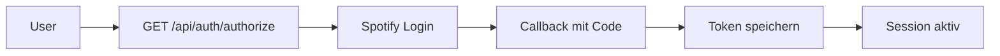
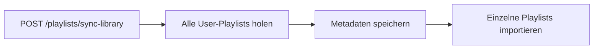

# Spotify API Playlist Roadmap

> **Version:** 1.0  
> **Last Updated:** 2025-11-25  
> **Status:** Active Development

---

## Übersicht

Diese Roadmap dokumentiert den aktuellen Stand der Spotify Playlist API-Integration in SoulSpot, zeigt auf, welche Funktionen bereits nutzbar sind und welche Features noch ausstehen.

---

## ✅ Was wurde schon implementiert?

### 1. OAuth-Authentifizierung für Playlists (Vollständig)

| Feature | Status | Beschreibung |
|---------|--------|--------------|
| **OAuth 2.0 PKCE Flow** | ✅ Fertig | Sichere Authentifizierung für Playlist-Zugriff |
| **Token-Verwaltung** | ✅ Fertig | Automatisches Refresh von Access Tokens |
| **Playlist-Scopes** | ✅ Fertig | `playlist-read-private`, `playlist-read-collaborative` |

**Implementierung:**
- `src/soulspot/infrastructure/integrations/spotify_client.py` - Spotify API Client
- `src/soulspot/api/routers/auth.py` - OAuth Endpunkte

### 2. Spotify Client - Playlist-Methoden (Vollständig)

| Methode | Status | Beschreibung |
|---------|--------|--------------|
| `get_playlist()` | ✅ Fertig | Einzelne Playlist mit Tracks abrufen |
| `get_user_playlists()` | ✅ Fertig | Alle User-Playlists mit Pagination |

**Implementierung:**
- `src/soulspot/infrastructure/integrations/spotify_client.py`

### 3. Playlist-Import & Synchronisation (Vollständig)

| Feature | Status | Beschreibung |
|---------|--------|--------------|
| **Single Playlist Import** | ✅ Fertig | Import per Playlist-ID oder URL |
| **URL-Parsing** | ✅ Fertig | Akzeptiert sowohl URLs als auch IDs |
| **Playlist Library Sync** | ✅ Fertig | Alle User-Playlists importieren (nur Metadaten) |
| **Single Playlist Sync** | ✅ Fertig | Bestehende Playlist aktualisieren |
| **Sync All Playlists** | ✅ Fertig | Alle Playlists aktualisieren |
| **Track-Import** | ✅ Fertig | Tracks werden mit Artist/Album erstellt |

**API-Endpunkte:**
```
POST /api/playlists/import        # Einzelne Playlist importieren
POST /api/playlists/sync-library  # Alle User-Playlists synchronisieren
POST /api/playlists/{id}/sync     # Einzelne Playlist aktualisieren
POST /api/playlists/sync-all      # Alle Playlists aktualisieren
```

**Implementierung:**
- `src/soulspot/api/routers/playlists.py` - API-Endpunkte
- `src/soulspot/application/use_cases/import_spotify_playlist.py` - Use Case

### 4. Playlist-Verwaltung (Vollständig)

| Feature | Status | Beschreibung |
|---------|--------|--------------|
| **Playlist auflisten** | ✅ Fertig | Paginierte Liste aller Playlists |
| **Playlist-Details** | ✅ Fertig | Details einer Playlist abrufen |
| **Missing Tracks** | ✅ Fertig | Tracks ohne lokale Datei identifizieren |
| **Download Missing** | ✅ Fertig | Fehlende Tracks zum Download vorbereiten |

**API-Endpunkte:**
```
GET  /api/playlists/                      # Alle Playlists auflisten
GET  /api/playlists/{id}                  # Playlist-Details
GET  /api/playlists/{id}/missing-tracks   # Fehlende Tracks
POST /api/playlists/{id}/download-missing # Download fehlender Tracks vorbereiten
```

### 5. Playlist-Export (Vollständig)

| Format | Status | Beschreibung |
|--------|--------|--------------|
| **M3U** | ✅ Fertig | Standard-Playlist-Format für Mediaplayer |
| **CSV** | ✅ Fertig | Tabellarisches Format für Excel/Sheets |
| **JSON** | ✅ Fertig | Vollständiger Datenexport |

**API-Endpunkte:**
```
GET /api/playlists/{id}/export/m3u   # M3U-Export
GET /api/playlists/{id}/export/csv   # CSV-Export
GET /api/playlists/{id}/export/json  # JSON-Export
```

### 6. Domain-Entität Playlist (Vollständig)

| Feature | Status | Beschreibung |
|---------|--------|--------------|
| `Playlist` Entity | ✅ Fertig | Playlist-Entität mit Name, Description, Source |
| `PlaylistSource` Enum | ✅ Fertig | SPOTIFY oder MANUAL |
| `SpotifyUri` Value Object | ✅ Fertig | Validierung von Spotify URIs |
| `PlaylistId` Value Object | ✅ Fertig | UUID-basierte IDs |
| `add_track()` / `remove_track()` | ✅ Fertig | Track-Management Methoden |

**Implementierung:**
- `src/soulspot/domain/entities/__init__.py`
- `src/soulspot/domain/value_objects/`

### 7. Datenbank-Persistenz (Vollständig)

| Feature | Status | Beschreibung |
|---------|--------|--------------|
| **PlaylistModel** | ✅ Fertig | SQLAlchemy Model mit Spotify URI |
| **PlaylistTrackModel** | ✅ Fertig | Association Table für Playlist-Tracks |
| **PlaylistRepository** | ✅ Fertig | CRUD + Spotify URI Lookup |
| `get_by_spotify_uri()` | ✅ Fertig | Playlist per Spotify URI finden |
| `add_track()` | ✅ Fertig | Track zu Playlist hinzufügen |

---

## 🎯 Was können wir schon machen?

### Nutzbare Workflows

#### 1. Spotify-Anmeldung


#### 2. Playlist importieren
```mermaid
graph LR
    A[Spotify URL/ID] --> B[POST /playlists/import]
    B --> C[Playlist + Tracks speichern]
    C --> D[GET /playlists/{id}]
```

#### 3. Gesamte Bibliothek synchronisieren


#### 4. Missing Tracks identifizieren und herunterladen
```mermaid
graph LR
    A[GET /playlists/{id}/missing-tracks] --> B[Liste fehlender Tracks]
    B --> C[POST /downloads/batch]
    C --> D[Downloads starten]
```

### Vollständig nutzbare Features

| Feature | Nutzbar? | Wie nutzen |
|---------|----------|------------|
| Spotify verbinden | ✅ Ja | `GET /api/auth/authorize` → Spotify Login |
| Playlist per URL importieren | ✅ Ja | `POST /api/playlists/import?playlist_id=URL` |
| Alle Playlists synchronisieren | ✅ Ja | `POST /api/playlists/sync-library` |
| Playlist exportieren (M3U/CSV/JSON) | ✅ Ja | `GET /api/playlists/{id}/export/{format}` |
| Fehlende Tracks finden | ✅ Ja | `GET /api/playlists/{id}/missing-tracks` |
| Playlist aktualisieren | ✅ Ja | `POST /api/playlists/{id}/sync` |

---

## 🚧 Was fehlt noch?

### Priorität: HOCH (P0)

#### 1. Erweiterte Playlist-Metadaten
**Status:** 📋 Geplant | **Effort:** Medium

| Feature | Status | Beschreibung |
|---------|--------|--------------|
| `snapshot_id` speichern | 📋 Geplant | Für effiziente Change Detection |
| `owner` Informationen | 📋 Geplant | Playlist-Ersteller mit ID und Name |
| `followers_total` | 📋 Geplant | Popularitäts-Tracking |
| `collaborative` Flag | 📋 Geplant | Kollaborative Playlist erkennen |
| `images` Array | 📋 Geplant | Playlist-Cover in verschiedenen Größen |

**Warum wichtig?**
- `snapshot_id` ermöglicht schnelle Änderungserkennung ohne alle Tracks zu laden
- Cover-Images verbessern die UI
- Owner-Info für kollaborative Playlists

#### 2. Playlist-Items (Position & Metadaten)
**Status:** 📋 Geplant | **Effort:** Groß

| Feature | Status | Beschreibung |
|---------|--------|--------------|
| `position` speichern | 📋 Geplant | Reihenfolge in Playlist |
| `added_at` Timestamp | 📋 Geplant | Wann Track hinzugefügt wurde |
| `added_by` User | 📋 Geplant | Wer Track hinzugefügt hat |
| `is_local` Flag | 📋 Geplant | Lokale Tracks erkennen |
| `track_raw` JSON | 📋 Geplant | Original Spotify-Daten cachen |

**Warum wichtig?**
- Position ist kritisch für korrekte Playlist-Reihenfolge
- Kollaborative Playlists zeigen, wer welchen Track hinzugefügt hat
- Lokale Tracks haben keine Spotify-ID

#### 3. Incremental Sync via snapshot_id
**Status:** 📋 Geplant | **Effort:** Medium

```python
# Konzept
async def should_sync_playlist(playlist_id: str) -> bool:
    current = await spotify_client.get_playlist(playlist_id)
    stored = await playlist_repo.get_by_spotify_id(playlist_id)
    return current["snapshot_id"] != stored.snapshot_id
```

**Warum wichtig?**
- Vermeidet unnötige API-Calls
- Schnellere Synchronisation großer Playlists
- Reduziert Spotify API Rate Limit Risiko

### Priorität: MITTEL (P1)

#### 4. Lokale Track-Behandlung
**Status:** 📋 Geplant | **Effort:** Klein

| Feature | Status | Beschreibung |
|---------|--------|--------------|
| `is_local` erkennen | 📋 Geplant | Lokale Tracks haben keine Spotify-ID |
| Skip-Logik | 📋 Geplant | Lokale Tracks nicht zum Download queuen |
| UI-Hinweis | 📋 Geplant | User über lokale Tracks informieren |

#### 5. Nicht verfügbare Tracks behandeln
**Status:** 📋 Geplant | **Effort:** Klein

| Feature | Status | Beschreibung |
|---------|--------|--------------|
| `track: null` erkennen | 📋 Geplant | Gelöschte/regional nicht verfügbare Tracks |
| Markierung in DB | 📋 Geplant | Status "unavailable" speichern |
| Letzte bekannte Daten | 📋 Geplant | `track_raw` für historische Referenz |

#### 6. Playlist-Modifikations-API
**Status:** 📋 Geplant | **Effort:** Groß

| Feature | Status | Beschreibung |
|---------|--------|--------------|
| Playlist erstellen | 📋 Geplant | Neue Spotify-Playlist anlegen |
| Tracks hinzufügen | 📋 Geplant | Tracks zu Playlist hinzufügen |
| Tracks entfernen | 📋 Geplant | Tracks aus Playlist entfernen |
| Playlist-Details ändern | 📋 Geplant | Name, Beschreibung, Sichtbarkeit |

**Benötigte Scopes:** `playlist-modify-public`, `playlist-modify-private`

### Priorität: NIEDRIG (P2)

#### 7. Playlist-Duplikat-Erkennung
**Status:** 📋 Geplant | **Effort:** Medium

| Feature | Status | Beschreibung |
|---------|--------|--------------|
| Track-Überschneidung | 📋 Geplant | Gemeinsame Tracks zwischen Playlists |
| Ähnlichkeits-Score | 📋 Geplant | Jaccard-Similarity berechnen |
| Merge-Vorschläge | 📋 Geplant | Ähnliche Playlists zusammenführen |

#### 8. Popularitäts-Tracking
**Status:** 📋 Geplant | **Effort:** Klein

| Feature | Status | Beschreibung |
|---------|--------|--------------|
| Followers-Historie | 📋 Geplant | Followers-Entwicklung tracken |
| Tracks-Historie | 📋 Geplant | Track-Anzahl über Zeit |
| Trending erkennen | 📋 Geplant | Wachsende Playlists identifizieren |

#### 9. Batch-Playlist-Import
**Status:** 📋 Geplant | **Effort:** Medium

| Feature | Status | Beschreibung |
|---------|--------|--------------|
| Multiple URLs | 📋 Geplant | Mehrere Playlists gleichzeitig importieren |
| Background Job | 📋 Geplant | Import als Hintergrund-Task |
| Progress-Tracking | 📋 Geplant | Fortschritt per SSE/WebSocket |

---

## 📊 Implementierungs-Übersicht

| Kategorie | Implementiert | Geplant | Gesamt |
|-----------|---------------|---------|--------|
| OAuth für Playlists | 3 | 0 | 3 |
| Spotify Client (Playlists) | 2 | 0 | 2 |
| Playlist Import/Sync | 6 | 0 | 6 |
| Playlist Verwaltung | 4 | 0 | 4 |
| Playlist Export | 3 | 0 | 3 |
| Playlist Entity & Persistenz | 8 | 0 | 8 |
| Erweiterte Metadaten | 0 | 5 | 5 |
| Playlist Items | 0 | 5 | 5 |
| Incremental Sync | 0 | 1 | 1 |
| Lokale/Unavailable Tracks | 0 | 6 | 6 |
| Modifikations-API | 0 | 4 | 4 |
| **Gesamt** | **26** | **21** | **47** |

**Implementierungsgrad:** ~55%

---

## 🛠️ Nächste Schritte (Empfehlung)

> **Hinweis:** Zeitschätzungen basieren auf Vollzeit-Entwicklung (40h/Woche) durch einen Backend-Entwickler.

### Phase 1: Metadaten-Erweiterung (~2-3 Entwickler-Wochen)
1. `PlaylistModel` um `snapshot_id`, `owner`, `images` erweitern
2. Alembic Migration erstellen
3. `SpotifyClient` Response-Handling anpassen
4. Tests schreiben

### Phase 2: Playlist-Items (~3-4 Entwickler-Wochen)
1. `PlaylistItemModel` erstellen
2. `position`, `added_at`, `added_by` speichern
3. Incremental Sync via `snapshot_id` implementieren
4. Integration Tests

### Phase 3: Edge Cases (~1-2 Entwickler-Wochen)
1. Lokale Tracks (`is_local`) behandeln
2. Nicht verfügbare Tracks (`track: null`) behandeln
3. UI-Hinweise implementieren

---

## 📚 Verwandte Dokumentation

- [Playlist Management Feature](./playlist-management.md) - Feature-Dokumentation für Anwender
- [Spotify Playlist API Reference](../api/spotify-playlist-api.md) - Technische API-Referenz
- [Backend Roadmap](../development/backend-roadmap.md) - Gesamte Backend-Entwicklung
- [Authentication](./authentication.md) - OAuth-Dokumentation

---

## 📝 Changelog

### 2025-11-25: Initiale Roadmap
- Analyse des aktuellen Implementierungsstands
- Dokumentation aller implementierten Features
- Identifikation fehlender Features mit Prioritäten
- Erstellung der Implementierungs-Empfehlung

---

*Diese Roadmap wird kontinuierlich aktualisiert, wenn neue Features implementiert werden.*
